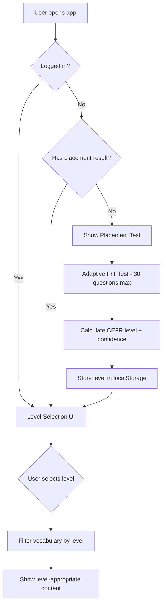

# Vocab Trainer — Level Selection & Placement Test System Design

## Overview

This document describes the design for a **dual-mode English vocabulary training system**:

1. **Placement Test Mode** (non-logged-in / first-time users) — Adaptive IRT-based test to determine CEFR level
2. **Level Selection Mode** (logged-in users / users with placement result) — User chooses their own CEFR level (A1–C2)

The vocabulary content is filtered based on the determined/chosen CEFR level.

---

## Current Architecture Analysis

### Existing Components

| File | Purpose |
|------|---------|
| `cefr.js` | CEFR level definitions, day-to-level mapping, storage helpers |
| `placement.js` | Adaptive IRT-based placement test (30 questions, 5 per CEFR level) |
| `auth.js` | Authentication (Firebase/Backend/Static), user data sync |
| `vocab-data.js` / `vocab-data-*.js` | Vocabulary organized by day (days 1-159) |
| `app.js` | Main app logic, SRS, games, UI rendering |

### CEFR Level ↔ Day Mapping (from `cefr.js`)

```javascript
const CEFR_START_DAY = { A1: 4, A2: 5, B1: 6, B2: 7, C1: 8, C2: 9 };
const CEFR_END_DAY   = { A1: 19, A2: 29, B1: 39, B2: 49, C1: 59, C2: 69 };
// A1→A2 Progress Path: Days 70-159 (90 days) — mapped to A2 level
```

**Vocabulary per level:**
- A1: Days 4, 10-19 (11 days × ~10 words = ~110 words)
- A2: Days 5, 20-29 (11 days = ~110 words) + Progress Path Days 70-159 (90 days = ~900 words)
- B1: Days 6, 30-39 (11 days = ~110 words)
- B2: Days 7, 40-49 (11 days = ~110 words)
- C1: Days 8, 50-59 (11 days = ~110 words)
- C2: Days 9, 60-69 (11 days = ~110 words)

---

## System Design

### User Flow



### Two Modes

#### Mode 1: Placement Test (Non-logged-in / First Visit)

- **Trigger**: User is not logged in AND `hasTakenPlacementTest() === false`
- **Implementation**: Already exists in `placement.js`
- **Result**: Stores `cefrLevel` in `vocab_progress_v1` via `setCefrLevel()`
- **UI**: Shows in `#placementTest` panel on Home view (see `index.html` line 113)

#### Mode 2: Level Selection (Logged-in / Has Placement Result)

- **Trigger**: User is logged in OR `hasTakenPlacementTest() === true`
- **New Feature**: Level selector UI in Settings and/or Home
- **Storage**: `settings.selectedCefrLevel` (user preference) + `progress.cefrLevel` (placement result)
- **Priority**: User selection > Placement result > Default (A1)

---

## Implementation Plan

### 1. Data Model Extensions

#### Settings (add to `vocab_settings_v1`)
```javascript
{
  // ... existing settings
  selectedCefrLevel: "A1" | "A2" | "B1" | "B2" | "C1" | "C2" | null,  // User's manual choice
  usePlacementLevel: true  // Whether to auto-use placement result
}
```

#### Progress (already exists in `vocab_progress_v1`)
```javascript
{
  // ... existing progress
  cefrLevel: "A1" | "A2" | "B1" | "B2" | "C1" | "C2" | null,  // From placement test
  cefrConfidence: 0.85,  // Confidence score from IRT
  placementDate: "2026-08-09"
}
```

### 2. Core Logic: `getEffectiveCefrLevel()`

```javascript
// In app.js or new cefr-selector.js module
function getEffectiveCefrLevel() {
  // Priority 1: User's explicit selection (logged-in users)
  if (settings.selectedCefrLevel && window.VocabAuth?.isLoggedIn()) {
    return settings.selectedCefrLevel;
  }
  
  // Priority 2: Placement test result
  if (hasTakenPlacementTest()) {
    return getCefrLevel();
  }
  
  // Priority 3: Default for new users
  return "A1";
}
```

### 3. Vocabulary Filtering

```javascript
function getItemsForLevel(level) {
  const days = cefrDaysForLevel(level);
  return ITEMS.filter(item => days.includes(item.day));
}

// For games/sessions — replace ITEMS with filtered list
function getFilteredItems() {
  const level = getEffectiveCefrLevel();
  return getItemsForLevel(level);
}
```

### 4. UI Components

#### A. Level Selector (Settings View)
Location: `index.html` → `#view-settings` panel

```html
<div class="settings-row">
  <span data-i18n="settings.cefrLevel">CEFR Level</span>
  <div class="cefr-level-selector" id="cefrLevelSelector">
    <!-- Buttons for A1-C2 -->
  </div>
</div>
<div class="settings-row">
  <span data-i18n="settings.usePlacement">ใช้ระดับจากแบบทดสอบ</span>
  <button class="btn" id="togglePlacementLevel">On</button>
</div>
```

#### B. Current Level Badge (Home View)
Show current effective level with option to change (if logged in)

```html
<div class="panel cefr-panel" id="cefrPanel">
  <h2><span class="ico" data-icon="medal"></span><span data-i18n="cefr.heading">Your CEFR Level</span></h2>
  <div class="cefr-current-badge" id="cefrCurrentBadge">
    <!-- Shows current level + change button if logged in -->
  </div>
  <div class="cefr-badge-row" id="cefrBadges"></div>
</div>
```

#### C. Placement Test Prompt (for logged-in users without placement)
If logged in but no placement result, offer to take test:

```html
<div class="placement-prompt" id="placementPrompt" hidden>
  <p>ยังไม่ได้ทำแบบทดสอบวัดระดับ — ต้องการทำเลยไหม?</p>
  <button class="btn btn-primary" id="takePlacementBtn">เริ่มแบบทดสอบ</button>
</div>
```

### 5. Integration Points

#### In `app.js` — Initialize on App Start
```javascript
// After loadInitialState()
function initCefrSystem() {
  const effectiveLevel = getEffectiveCefrLevel();
  
  // Filter vocabulary
  window.CURRENT_CEFR_LEVEL = effectiveLevel;
  window.FILTERED_ITEMS = getItemsForLevel(effectiveLevel);
  
  // Update UI
  renderCefrPanel();
  renderLevelSelector();
  
  // Re-initialize games with filtered items
  if (window.VocabGames) window.VocabGames.refreshItems(window.FILTERED_ITEMS);
}
```

#### In Games — Use Filtered Items
All game modes should read from `window.FILTERED_ITEMS` instead of `ITEMS`:
- Flashcards
- Quiz
- Fill-in-the-Blank
- Card Match
- True/False
- Hangman
- Sentence Builder
- Cloze
- Listen & Type
- Pronunciation
- Boss Rush
- Daily Tasks

#### In Browse View — Filter by Level
```javascript
function renderBrowse() {
  const level = getEffectiveCefrLevel();
  const items = getItemsForLevel(level);
  // ... render with level filter chips
}
```

#### In Statistics — Show Level Context
```javascript
function renderStats() {
  const level = getEffectiveCefrLevel();
  // Show stats for current level's vocabulary
}
```

### 6. Auth Integration

#### On Login (`auth.js` → `login()` / `register()` success)
```javascript
// After successful login
async function onLoginSuccess(userData) {
  // Sync backend data
  await syncBackendDataToLocal(userData.userId);
  
  // Initialize CEFR system
  if (window.VocabApp && window.VocabApp.initCefrSystem) {
    window.VocabApp.initCefrSystem();
  }
  
  // If user has no placement result AND no manual selection → prompt placement
  if (!hasTakenPlacementTest() && !settings.selectedCefrLevel) {
    showPlacementPrompt();
  }
}
```

#### On Logout (`auth.js` → `logout()`)
```javascript
function onLogout() {
  clearAuth();
  // Reset to placement test mode
  window.CURRENT_CEFR_LEVEL = null;
  window.FILTERED_ITEMS = null;
  // Placement test will show automatically (hasTakenPlacementTest() checks localStorage)
  location.reload();
}
```

---

## UI/UX Details

### Level Selector Design (Settings)

```
┌─────────────────────────────────────────────┐
│  CEFR Level                    [A1] [A2] [B1]│
│  ─────────────────────────────────────────  │
│  [B2] [C1] [C2]                             │
│                                             │
│  Current: B1 Intermediate (selected)        │
│  ใช้ระดับจากแบบทดสอบ: [On]                 │
└─────────────────────────────────────────────┘
```

- **Visual**: Chip group with 6 buttons (A1–C2)
- **Active state**: Highlighted with level color
- **Locked state**: Not applicable — all levels available to choose
- **Tooltip**: Show level name + word count on hover

### Current Level Badge (Home)

```
┌────────────────────────────────────┐
│  Your CEFR Level          [Change] │
│  ┌──────────────────────────────┐  │
│  │     B1 Intermediate          │  │
│  │     ~110 words available     │  │
│  │     [●●●○○○○] 45% to B2      │  │
│  └──────────────────────────────┘  │
│                                     │
│  A1  A2  B1  B2  C1  C2  (badges)  │
└────────────────────────────────────┘
```

- **For logged-in users**: Shows "Change" button → opens level selector modal
- **For non-logged-in**: Shows placement test result only
- **Progress bar**: Shows progress toward next level (from placement test)

### Placement Test Prompt (Logged-in, No Placement)

```
┌────────────────────────────────────┐
│  📝 ยังไม่ได้ทำแบบทดสอบวัดระดับ    │
│                                     │
│  ทำแบบทดสอบ 2-4 นาที เพื่อให้      │
│  ระบบจัดแผนเรียนที่เหมาะกับคุณ      │
│                                     │
│  [เริ่มแบบทดสอบ]  [ข้าม]           │
└────────────────────────────────────┘
```

---

## Word Count Estimates by Level

| Level | Days | Est. Words | Notes |
|-------|------|------------|-------|
| A1 | 11 | ~110 | Basic vocabulary |
| A2 | 11 + 90 (Progress Path) | ~1010 | **Largest** — includes 90-day A1→A2 path |
| B1 | 11 | ~110 | Intermediate |
| B2 | 11 | ~110 | Upper-Intermediate |
| C1 | 11 | ~110 | Advanced |
| C2 | 11 | ~110 | Expert |

> **Note**: A2 has significantly more words due to the 90-day Progress Path (Days 70-159). Consider this when designing the UI — show word counts so users know what they're choosing.

---

## Migration Strategy

### Phase 1: Core Logic (No UI Changes)
1. Add `getEffectiveCefrLevel()` function
2. Add `getFilteredItems()` function
3. Modify `getAllItems()` or create filtered version
4. Update all game modes to use filtered items

### Phase 2: Settings UI
1. Add CEFR level selector to Settings view
2. Add "Use placement level" toggle
3. Persist to `settings.selectedCefrLevel`

### Phase 3: Home View Integration
1. Update CEFR panel to show current effective level
2. Add "Change Level" button for logged-in users
3. Show placement prompt for logged-in users without placement

### Phase 4: Auth Integration
1. Call `initCefrSystem()` on login
2. Reset on logout
3. Handle placement test completion → update level

### Phase 5: Polish
1. Add transitions/animations
2. Show word count per level in selector
3. Add tooltips with level descriptions
4. Test all game modes with filtered vocabulary

---

## Code Changes Summary

### New Files
- `web/vocab/assets/js/cefr-selector.js` — Level selection logic & UI

### Modified Files
- `web/vocab/assets/js/app.js` — Integrate filtered items, init CEFR system
- `web/vocab/assets/js/auth.js` — Call CEFR init on login/logout
- `web/vocab/assets/js/cefr.js` — Export helper functions
- `web/vocab/index.html` — Add UI elements for level selector
- `web/vocab/assets/css/style.css` — Styles for new UI components

### Key Functions to Add/Modify

```javascript
// cefr-selector.js
export function getEffectiveCefrLevel() { ... }
export function getItemsForLevel(level) { ... }
export function getFilteredItems() { ... }
export function renderLevelSelector() { ... }
export function renderCefrPanel() { ... }
export function initCefrSystem() { ... }
export function showPlacementPrompt() { ... }
export function onLevelChange(newLevel) { ... }

// app.js
// Replace ITEMS usage with FILTERED_ITEMS in all game modes
// Call initCefrSystem() after loadInitialState()

// auth.js
// In login/register success: call initCefrSystem()
// In logout: reset CEFR state
```

---

## Testing Checklist

- [ ] Non-logged-in user sees placement test on first visit
- [ ] Placement test completes → stores level → shows level-appropriate content
- [ ] Logged-in user can select any level A1-C2
- [ ] Level selection persists across sessions
- [ ] All game modes use filtered vocabulary
- [ ] Browse view filters by selected level
- [ ] Statistics show correct data for selected level
- [ ] Daily Tasks use selected level's vocabulary
- [ ] Logout → shows placement test (if no prior result)
- [ ] Login → restores user's selected level
- [ ] "Use placement level" toggle works correctly
- [ ] Word counts displayed correctly per level

---

## Future Enhancements

1. **Level-specific Daily Tasks** — Generate daily tasks from selected level's vocabulary
2. **Progress Path Integration** — For A1 users, auto-enroll in A1→A2 Progress Path
3. **Level Change Confirmation** — Warn user that changing level resets SRS for new words
4. **Placement Test Retake** — Allow logged-in users to retake placement test
5. **Level Recommendations** — Suggest level based on performance statistics
6. **Mixed Level Mode** — Option to practice across multiple levels